<p align="center">
  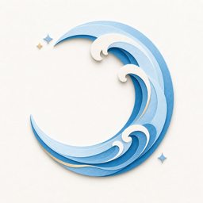
</p>

<h1 align="center">MoonWave · 月潮</h1>

<p align="center">
  <strong>Feel Your Wave. Be Your Wave.</strong><br/>
  用潮汐隐喻理解身体节奏 —— 记录、看见、温柔调整。
</p>

<p align="center">
  <a href="https://moon-wave.vercel.app/">在线体验</a>
  ·
  <a href="#本地开发">本地运行</a>
  ·
  <a href="#功能概览">功能</a>
</p>

---

## 简介

MoonWave（月潮）是一款面向 menstrual cycle 的 Web 应用。它不追求「标准答案」，而是帮你把身体变化放进一条可记录、可回看、可慢慢理解的路径里。

核心思路：**记录 → 理解 → 调整 → 观察反馈 → 积累 → 更了解自己**，然后进入下一次潮汐。

<p align="center">
  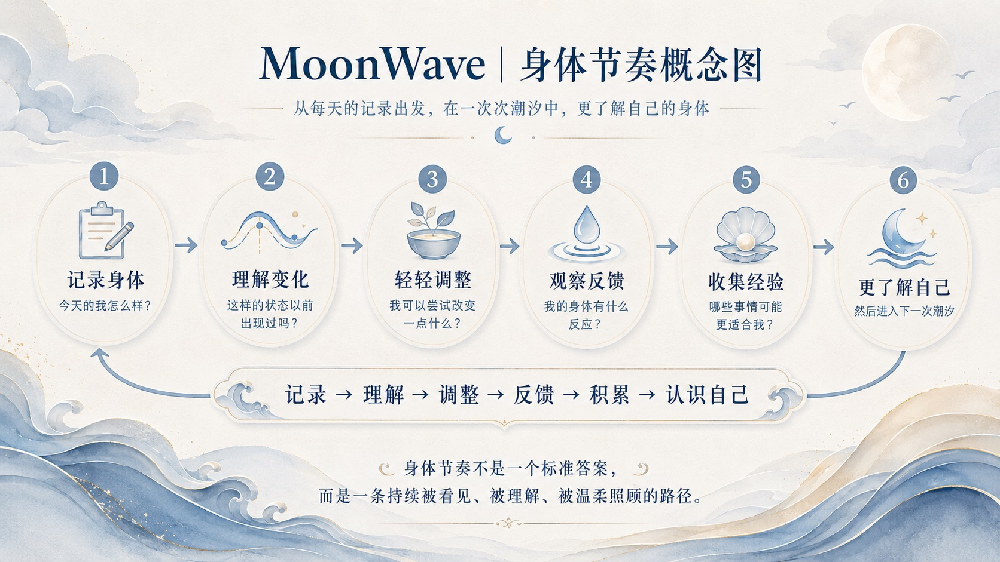
</p>

---

## 功能概览

| 模块 | 说明 |
|------|------|
| **首页 · 纸海岸** | 今日潮汐状态、快速记录、为你推荐、正念与身体小实验 |
| **统计 · 看见规律** | 周期长度、症状与情绪趋势、激素曲线科普 |
| **探索 · 七座岛** | 锻炼、营养、睡眠、情绪、疼痛等主题内容地图 |
| **日历 · 潮汐视图** | 年 / 月 / 日切换，周期阶段与涨退潮隐喻 |
| **Crab · 陪伴** | 纸艺小蟹标记记录点，贝壳积分探索奖励 |
| **AI 日记** | 基于当日记录的轻量反思与整理（可选） |

### 首页

<p align="center">
  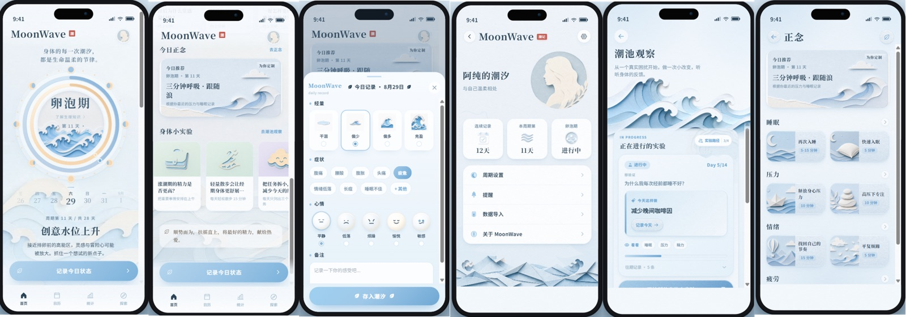
</p>

### 统计与激素曲线

<p align="center">
  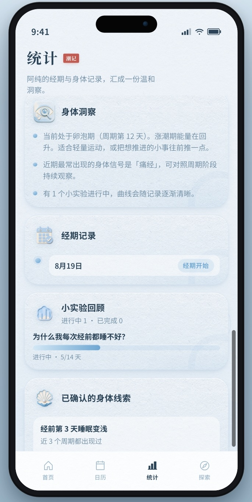
  &nbsp;
  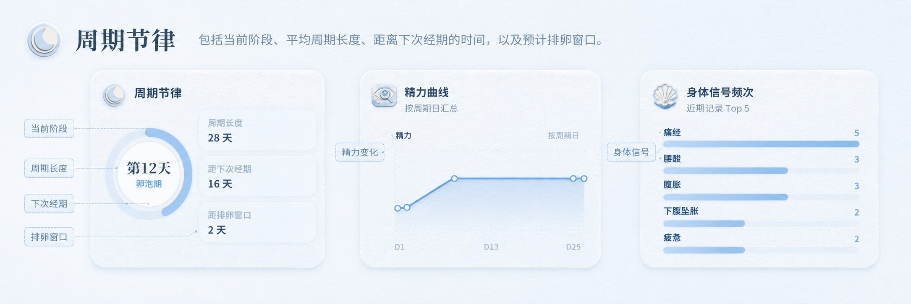
</p>

### 探索地图

<p align="center">
  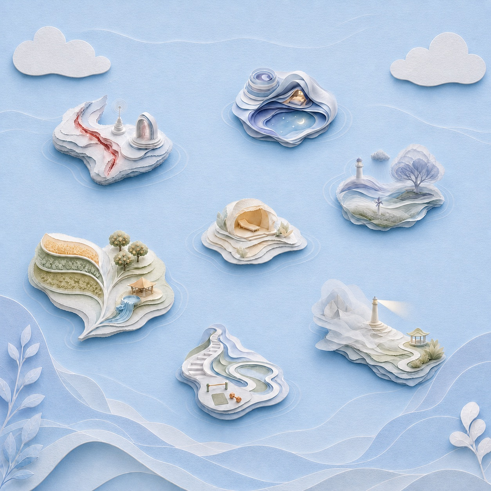
</p>

### Crab 与记录

<p align="center">
  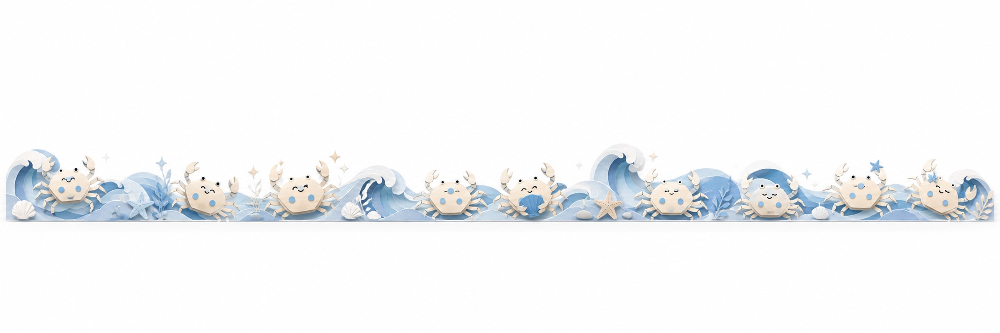
</p>

---

## 技术栈

- **框架** — React 19 + TypeScript + Vite 8
- **样式** — CSS Modules + Tailwind CSS 4
- **部署** — Vercel（含 Serverless API for AI 日记）
- **数据** — 本地存储为主，无账号体系

---

## 本地开发

```bash
git clone https://github.com/chx0506/Wave.git
cd Wave
npm install
npm run dev
```

浏览器打开 `http://localhost:5173`。

```bash
npm run build    # 生产构建
npm run preview  # 预览构建产物
npm run lint     # oxlint
```

---

## 项目结构

```
src/
├── screens/          # 页面：首页、统计、探索、日历、我的
├── components/       # UI 组件（coast / calendar / chrome …）
├── domain/           # 周期计算、文案、预测逻辑
├── data/             # 静态内容与文章
└── lib/              # 工具与音频等
api/                  # Vercel Serverless（AI 日记）
public/textures/      # 纸艺纹理与动画帧
docs/readme/          # README 截图资源
```

---

## 架构示意

<details>
<summary>导航与页面流</summary>

<p align="center">
  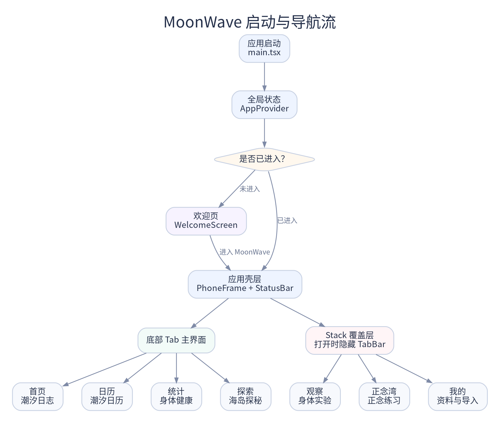
</p>

</details>

<details>
<summary>数据流与本地存储</summary>

<p align="center">
  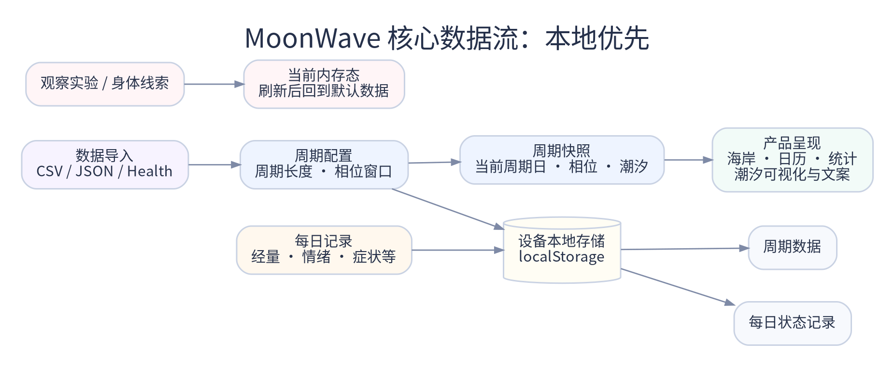
</p>

</details>

<details>
<summary>日记与 AI</summary>

<p align="center">
  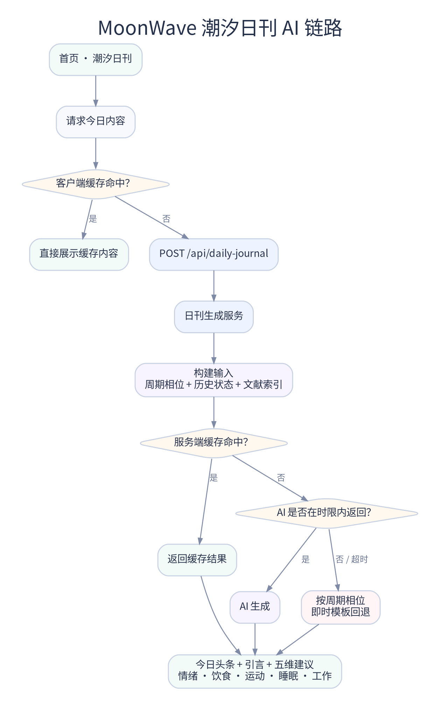
</p>

</details>

<details>
<summary>部署</summary>

<p align="center">
  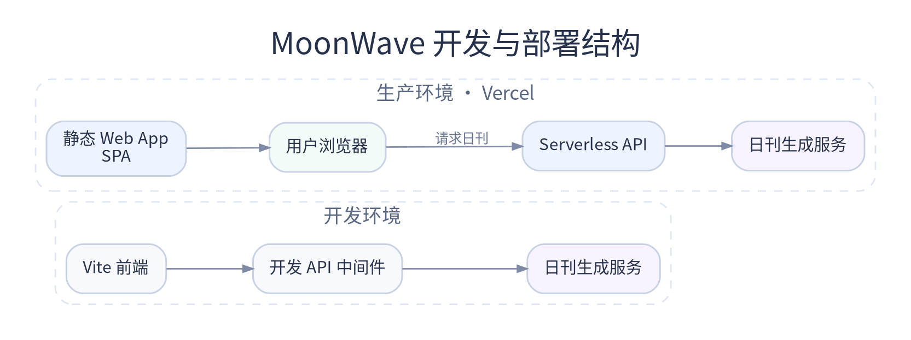
</p>

</details>

---

## Roadmap

- [x] 纸海岸首页与潮汐记录
- [x] 统计页与激素曲线科普
- [x] 探索地图与七座主题岛
- [x] 潮汐日历（年 / 月 / 日）
- [x] 身体小实验与正念推荐
- [x] AI 日记（Serverless）
- [ ] PWA 离线支持
- [ ] 多语言（中 / 英）
- [ ] 数据导出

---

## 设计说明

视觉语言为 **纸艺海岸（paper-coast）**：层叠纸浪、淡金与雾蓝、手绘质感。周期阶段对应潮汐隐喻 —— 退潮（月经期）、涨潮（卵泡期）、满潮（排卵期）、平潮（黄体期）。

---

<p align="center">
  <br/><br/>
  <strong>Feel Your Wave. Be Your Wave.</strong><br/>
  <sub>身体节奏不是标准答案，而是一条被看见、被理解、被温柔照顾的路径。</sub>
</p>

<p align="center">
  <sub>Made with care for every tide.</sub>
</p>
