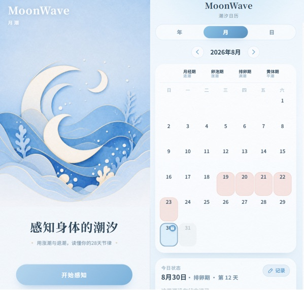
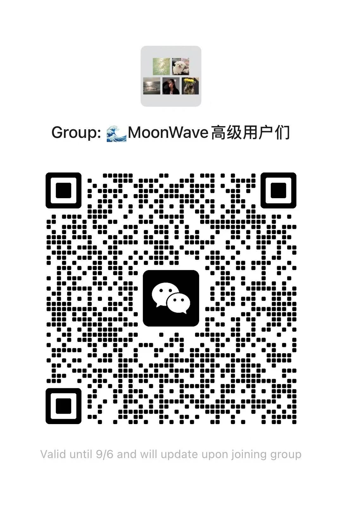
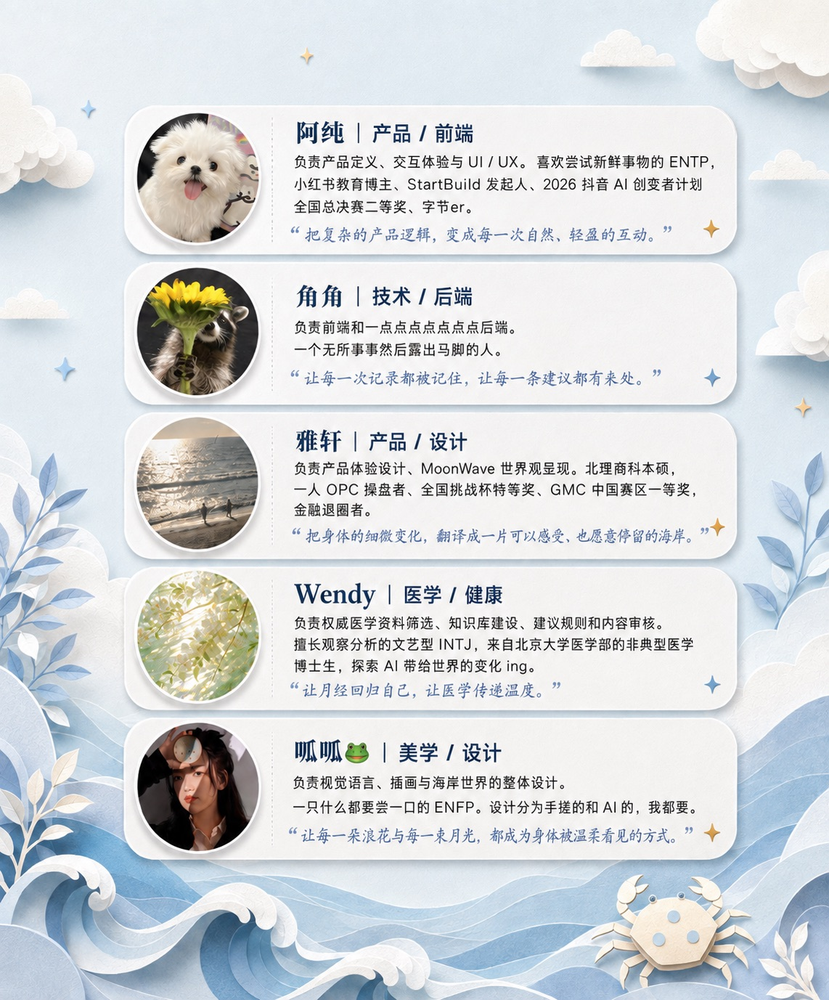

<p align="center">
  
</p>

<h1 align="center">月潮 · MoonWave</h1>

<p align="center"><strong>Feel Your Wave. Be Your Wave.</strong><br/>
读懂身体潮汐，找到自己节奏</p>

<p align="center">
  <a href="https://moon-wave.vercel.app/">在线 Demo</a> ·
  <a href="https://moon-wave.vercel.app/share/">介绍视频</a> ·
  <a href="#-本地开发">本地运行</a>
</p>

<p align="center">
  
</p>

---

## 先听见身体，再听见自己

许多周期 App 最先回答的是：月经什么时候来？什么时候可能排卵？受孕概率有多高？

但对暂时没有生育计划的人来说，记录月经的意义远不止于此。我们还想知道：

- 为什么这几天总是睡不好？
- 为什么有时格外疲惫、烦躁或没有精力？
- 今天适合怎样运动、饮食和安排工作？
- 哪些变化只是短暂波动，哪些情况值得继续观察？

**记录月经，不只是为了判断会不会怀孕，更是为了更好地生活。**

MoonWave 从这里开始：不只告诉用户下一次月经什么时候来，而是结合**今天的状态、过去的记录、周期变化与经医学审核的知识**，帮助她理解——

> **我的身体最近可能发生了什么，以及今天可以为自己做些什么。**

<p align="center">
  
</p>

我们希望从单纯的周期记录再往前一步：

**记录今天 → 理解此刻 → 获得具体建议 → 看见长期规律 → 找到自己的节奏。**

### 我们想陪伴谁？

- 已有周期记录习惯，但觉得「记完之后没有然后」的人  
- 经常经历 PMS、痛经、睡眠、疲劳、情绪波动的人  
- 希望获得更具体的饮食、运动、睡眠与工作学习建议的人  
- 想了解自己的长期规律，而不是只要一个统一答案的人  

> **她们不是缺一个月经日历，而是缺一个慢慢读懂自己的地方。**

---

## 在 MoonWave，身体变化可以被看见

<p align="center">
  
</p>

### 首页｜潮汐日志

> **今天，我的身体怎么样？**

首页呈现当前周期阶段与今日潮汐状态。用户可以轻量记录：

**经期 / 疼痛 / 情绪 / 睡眠 / 精力 / 压力 / 饮食 / 运动**

完成记录后，MoonWave 会结合**今天的状态 + 历史记录 + 周期上下文 + 经医学审核的知识库**，生成简短的**今日洞察**，并从这些方面给出少量建议：

**情绪 · 饮食 · 运动 · 睡眠 · 工作**

它不会因为你处在某个阶段就告诉你「应该怎样」，更关注：

> **结合你最近的记录，今天有什么值得留意，又可以先尝试什么。**

首页还会连接：

| 入口 | 作用 |
| :--- | :--- |
| **健康科普短卡** | 与当下阶段相关的轻阅读 |
| **静谧海湾** | 几分钟呼吸、情绪安抚、睡前放松；正念不是额外任务，而是需要时的靠岸处 |
| **潮池观察 · 身体小实验** | 一次只改一个变量，把「我好像每次都会这样」变成可观察的线索 |
| **每日祝福** | 一句轻盈的收束 |

潮汐映射：

| 潮位 | 周期阶段 |
| :--- | :--- |
| 退潮 | 月经期 |
| 涨潮 | 卵泡期 |
| 满潮 | 排卵期 |
| 平潮 | 黄体期 |

---

### 日历｜把今天放回周期里

> **一天的感受，放进完整的周期里，才更容易读懂自己。**

潮汐日历支持 **日 / 月 / 年**，查看经期与阶段、排卵窗口、每日状态与长期规律。月历下方还有周期潮汐轨迹、阶段说明，以及**激素变化参考趋势**（示意典型周期，不等于实测激素）。

希望日历不只说「今天是周期第几天」，还能帮助理解：**今天为什么可能和前几天不太一样。**

---

### 统计｜让记录慢慢形成规律

> **记录的意义，不只是留下今天，而是在时间里看见自己的节奏。**

<p align="center">
  
  &nbsp;
  
</p>

- **周期节律**：当前阶段、平均周期、距下次经期、预计排卵窗口  
- **身体洞察**：结合当前周期与历史，总结近期值得关注的变化  
- **经期记录**：开始时间、持续时间与周期变化  
- **小实验回顾**：进行中与已完成的生活方式观察  
- **个人身体线索**：多个周期中反复出现、并由自己确认过的经验  
- **数据导入**：让已有周期记录继续被使用  

这些不是医学诊断，而是进一步了解自己的线索。

---

### 探索｜海岛探秘

> **认识自己的身体，是一场寻找宝藏的旅程。**

<p align="center">
  
</p>

疼痛、缓解、疾病、睡眠、情绪、运动、营养等内容，变成可逐步打开的海岛与知识路径：

**发现 → 阅读 → 收藏 → 继续探索**

科普由团队整理创作，并与最近记录产生连接——不是贴标签，而是给你一张找到答案的地图。

---

### 我的｜我的潮汐

长期记录沉淀为周期线索、小实验、睡眠/情绪/精力趋势与个人经验，最终形成持续更新的 **身体航海日志**。若需要就医，也可通过 **Health Brief** 整理一段时间的记录，帮助更准确地描述自己的状态。

---

## Crab：一直在海边的那个伙伴

<p align="center">
  
</p>

Crab 不是第六个 Tab。它以浮窗出现在首页，也可在「我的」里深入交流。它连接今天的记录、最近的变化、身体观察、健康知识与正念内容——

> **记得最近发生了什么，也知道下一步可以去哪里的伙伴。**

负责的是：**记得、连接、提醒和陪伴。**

---

## 贝壳：让每一次照顾自己都留下回响

统一的 **贝壳积分体系**：

**获得**：每日记录 / 连续打卡 / 完成身体小实验 / 完成正念 / 探索健康知识 / 充值 VIP  

**使用**：解锁进阶健康内容、静谧海湾主题、Crab 与主页装扮、合作品牌礼品或权益  

积分不是为了机械签到，而是奖励：**关注自己、记录自己、理解自己、照顾自己。**

---

## AI 在背后做了什么？

<p align="center">
  
</p>

1. **整理每天的记录** → 结构化状态  
2. **找到历史规律** → 跨日、跨周期的个人模式  
3. **匹配医学参考** → 从审核过的知识库取证，而不是凭空生成健康结论  
4. **生成此刻相关的建议** → 限制在情绪支持、饮食与生活方式、温和运动、睡眠、工作节奏、正念、继续观察或就医提示  

> **AI 不替用户定义身体，而是帮助她看见、理解，学会照顾自己。**

---

## 技术架构与当前完成度

### 本地优先，AI 增强

周期设置、每日记录、潮汐计算与主要页面交互在设备侧完成；服务端主要承担「潮汐日刊」智能生成。AI 暂不可用时，核心记录与潮汐可视化仍可用。

| | |
| :--- | :--- |
| 前端 | React + TypeScript + Vite |
| 数据 | 浏览器本地存储为主 |
| 智能 | Vercel Serverless + 文献索引增强 |
| Demo | https://moon-wave.vercel.app/ |

<p align="center">
  
  
  
</p>

已形成：**周期数据 → 每日记录 → 潮汐呈现 → AI 日刊 → 探索与正念** 的完整 Demo 框架。当前以「单设备、本地优先」为主；观察实验与部分线索仍有运行时边界，账号与云端库尚未引入——下一阶段是把可完整体验的本地原型，推进到可长期积累个人身体数据的基础设施。

---

## 本地开发

```bash
git clone https://github.com/chx0506/Wave.git
cd Wave
npm install
npm run dev
```

```bash
npm run build    # 生产构建
npm run preview  # 预览构建结果
npm run lint
```

---

## 下一次涨潮

- 完善医学知识库、建议规则、身体线索、Health Brief 与个性化  
- 探索 Apple Health / Health Connect / 可穿戴接入  
- 让 Crab 走向持续学习与自然陪伴  
- 让贝壳连接真实女性健康与生活方式权益  
- **最重要的：找到真实用户，验证 MoonWave 是否真的让她更了解、更关心自己的身体**

---

<p align="center">
  <br/>
  
</p>

<p align="center">
  <strong>Feel Your Wave. Be Your Wave.</strong><br/>
  向内，让 AI 唤醒人与自己的连接；<br/>
  向外，让每一次真实的女性体验，成为下一次创新的起点。<br/><br/>
  <em>「原来，这就是我的节奏。」🌊</em>
</p>

<p align="center">
  <sub>Meet The WaveMakers</sub><br/>
  
</p>
