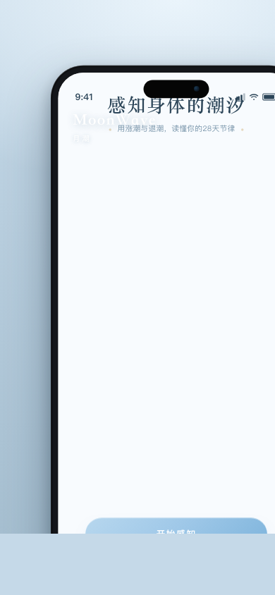
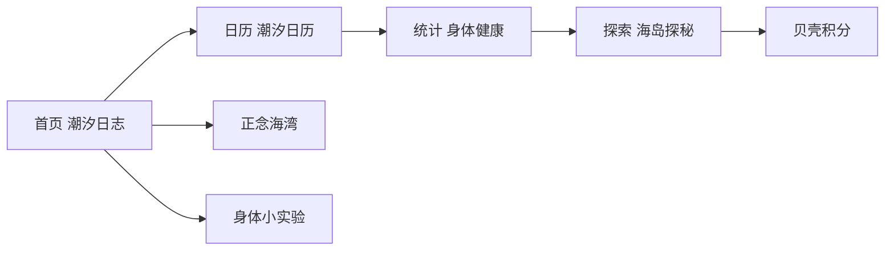
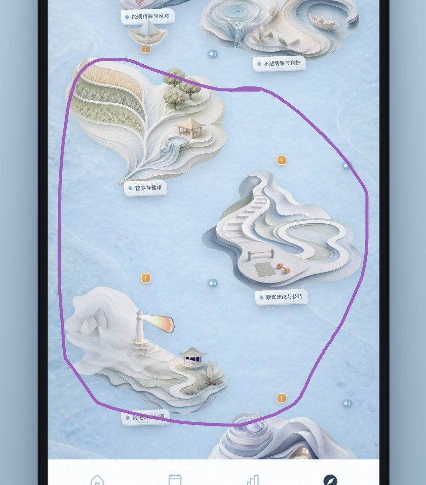
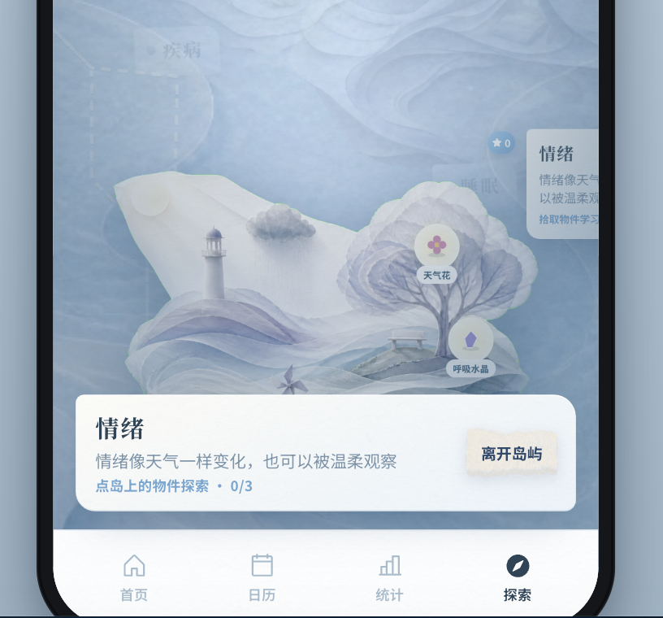
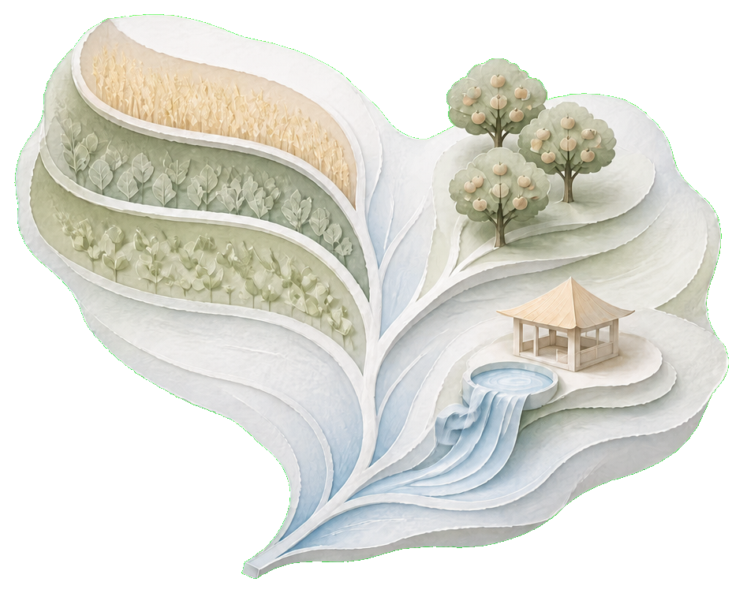
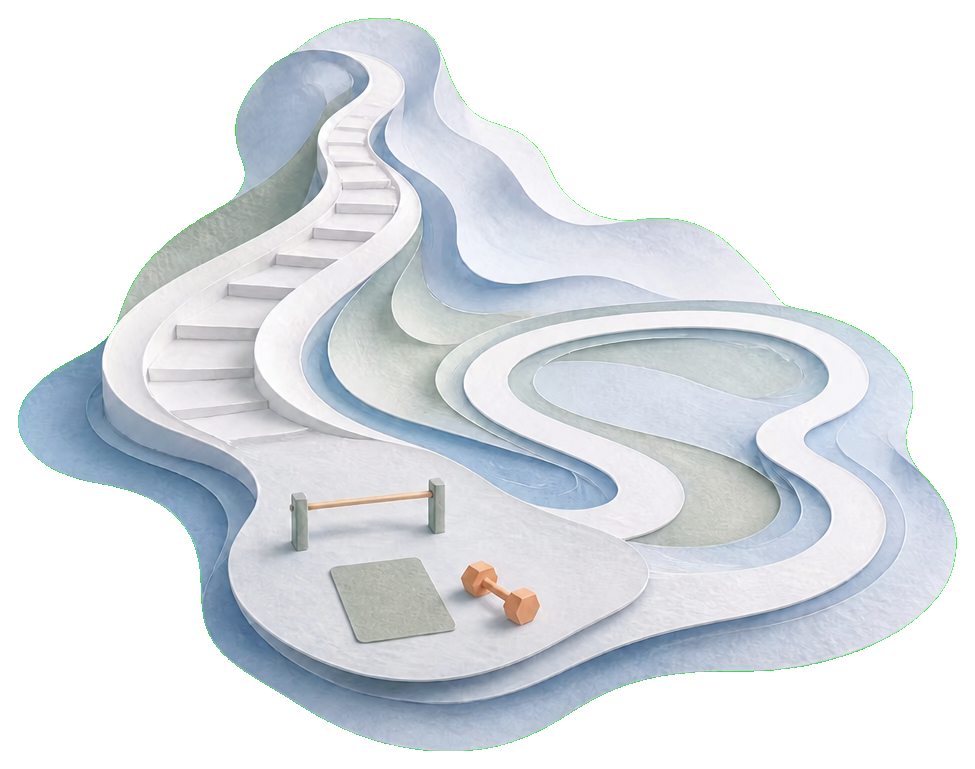
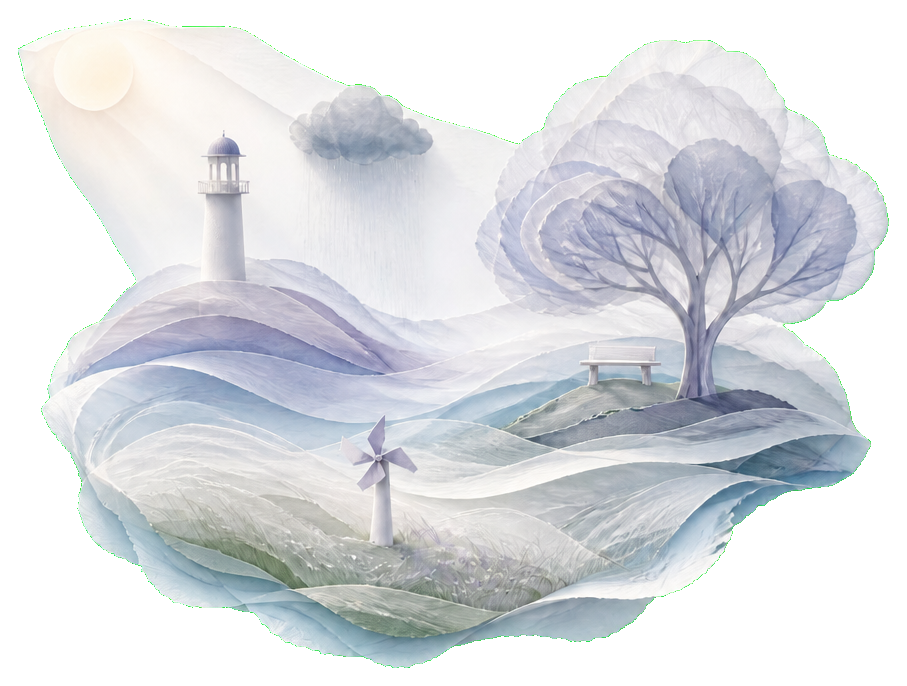
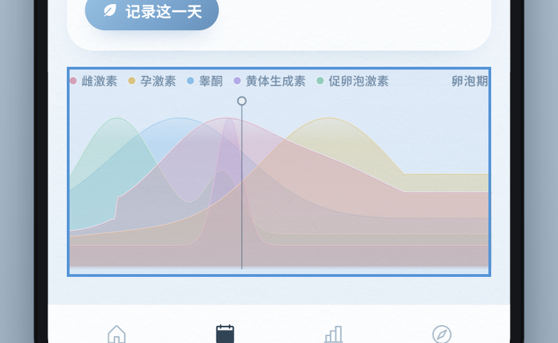
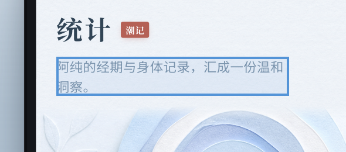

<p align="center">
  
</p>

<h1 align="center">月潮 · MoonWave</h1>

<p align="center">
  <strong>Feel Your Wave. Be Your Wave.</strong><br/>
  读懂身体的潮汐，找到自己的节奏。
</p>

<p align="center">
  <a href="https://moon-wave.vercel.app/"></a>
  
  
  
</p>

<p align="center">
  
</p>

---

## 这是什么？

**月潮（MoonWave）** 是一款以**潮汐**隐喻经期周期的温暖 Web App。  
它不把身体当成冰冷的仪表盘，而是把每一次周期写成退潮、涨潮、满潮与平潮——在纸艺海岸的世界里，轻轻记录、观察、练习与探索。

| | |
| :--- | :--- |
| **给谁用** | 希望用更柔软方式理解周期的人；偏爱隐喻与日常觉察，而不是临床表格 |
| **核心体验** | 潮汐日志 · 潮汐日历 · 身体统计 · 海岛探索 · 正念海湾 · 身体小实验 |
| **视觉语言** | 高调浅蓝纸浮雕 / 折纸海岸 · 中文优先 · 手机框移动 Web |

<p align="center">
  <a href="https://moon-wave.vercel.app/">🌐 在线体验 https://moon-wave.vercel.app/</a>
  ·
  <a href="https://moon-wave.vercel.app/share/">▶ 介绍视频 Share 页</a>
</p>

---

## 产品一览

### 四潮节律

周期阶段被映射成海岸潮位，方便用身体感受记忆：

| 潮位 | 周期阶段 | 感觉 |
| :--- | :--- | :--- |
| 退潮 | 月经期 | 释放与修复 |
| 涨潮 | 卵泡期 | 能量回升 |
| 满潮 | 排卵期 | 峰值与表达 |
| 平潮 | 黄体期 | 回落与整合 |

### 主要模块



| 模块 | 做什么 |
| :--- | :--- |
| **首页** | 潮汐表盘、今日状态、推荐科普、正念入口、身体小实验 |
| **日历** | 月/年/日视图、经期记录、激素曲线与科普 |
| **统计** | 连续记录、周期长度、线索与实验进度 |
| **探索** | 七座主题岛纸船航行、岛上物件解锁科普 |
| **我的** | 档案、导入、贝壳与装扮入口 |

---

## 界面速览

### 探索 · 七岛航线

点选岛屿，小纸船会绕岛驶去；登岛后可点物件阅读科普。右上角是 **贝壳积分**（不是星星）。

<p align="center">
  
  &nbsp;
  
</p>

**七座岛**

| 岛 | 主题 |
| :--- | :--- |
| 经期疼痛与应对 | 疼痛识别与应对 |
| 不适缓解与自护 | 呼吸、休息与轻量调整 |
| 营养与健康 | 饮食与能量补给 |
| 锻炼建议与技巧 | 不同阶段的活动强度 |
| 常见妇科问题 | 健康边界与求医时机 |
| 睡眠质量与休息 | 睡眠节律与入睡 |
| 心理健康 | 情绪如天气，可被温柔观察 |

<p align="center">
  
  
  
</p>

### 日历 · 激素曲线

典型周期激素走势（纸浪叠层曲线）+ 周期天数轴，下方可横滑浏览四激素科普。

<p align="center">
  
</p>

### 统计 · 潮记档案

连续记录、周期洞察与实验进度，纸艺蓝调界面。

<p align="center">
  
</p>

### 贝壳积分体系 🐚

> 让每一次照顾自己都留下回响。

**获得**：每日记录 · 连续打卡 · 完成身体小实验 · 完成正念 · 探索健康知识 · 充值 VIP  

**使用**：解锁进阶健康内容 · 静谧海湾主题 · Crab 与主页装扮 · 合作品牌礼品/权益  

贝壳不是机械打卡分，而是对自己关注、记录、理解与照顾的回响。

---

## 技术栈

| 层 | 选型 |
| :--- | :--- |
| UI | React 19 + TypeScript |
| 构建 | Vite 8 |
| 样式 | CSS Modules + Tailwind v4（局部） |
| 图标 | Phosphor Icons |
| 部署 | Vercel（生产：`moon-wave.vercel.app`） |
| 数据 | 本地优先（`localStorage` 等），强调隐私 |

```
src/
  screens/          # 首页 / 日历 / 统计 / 探索 / 我的 / 正念 …
  components/coast/ # 潮汐表盘、日历、激素曲线、小实验 Sheet …
  data/             # 岛世界、推荐、激素曲线、日志文案 …
  domain/           # 周期算法、日志、实验进度 …
  state/            # App 状态
  theme/            # 设计 token
```

---

## 本地开发

需要 Node.js 20+（建议与 Vercel 构建环境接近）。

```bash
git clone https://github.com/chx0506/Wave.git
cd Wave
npm install
npm run dev
```

常用命令：

```bash
npm run dev      # http://127.0.0.1:5173
npm run build    # tsc -b && vite build
npm run preview  # 预览生产构建
npm run lint     # oxlint
```

浏览器打开本地地址即可；产品以手机竖屏框体验为主。

---

## 设计原则（摘要）

- **潮汐隐喻优先**：文案与交互围绕退/涨/满/平，而不是冷冰冰的医疗报表口吻  
- **纸艺海岸**：浅蓝纸浮雕、折纸浪、岛屿与纸船  
- **中文优先**：界面与科普以中文为主  
- **一次一个变量**：身体小实验强调可坚持的小改变  
- **本地优先**：记录默认留在设备侧，用户决定分享什么  

更多产品说明见 [`PRODUCT.md`](./PRODUCT.md)。

---

## 路线与状态

当前已上线可体验 Demo（Vercel）。持续打磨中的方向包括：导入体验、贝壳兑换闭环、探索岛深读、以及更多个性化洞察。

---

## 许可与署名

私有/研究中的产品原型，版权归项目作者。若需引用或合作，请通过 GitHub Issues 联系。

<p align="center">
  <br/>
  <sub>月潮 · 读懂身体的潮汐</sub>
</p>
